<!-- Semua gambar di assets/ dibuat oleh scripts/build_assets.py dari profile.json.
     Ubah profile.json, bukan file SVG-nya. Workflow akan membangun ulang otomatis. -->

<a href="https://levvtzy.xyz">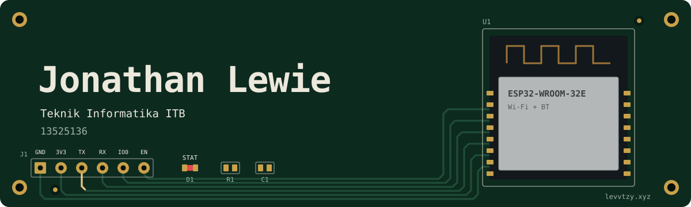</a>

  <a href="https://github.com/Levvroy/PRD-EcoThrow">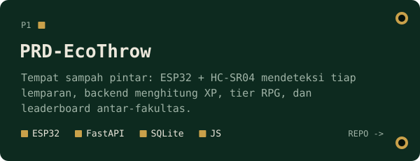</a>
  <a href="https://github.com/Levvroy/BayerDemosaic">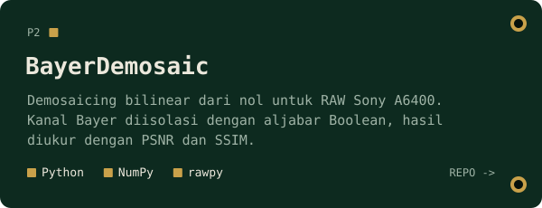</a>

  <a href="https://github.com/Levvroy/IF2150-RPL-K01-G08">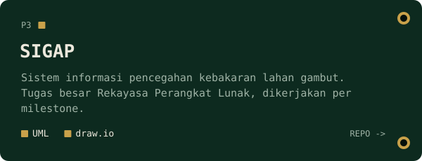</a>
  <a href="https://github.com/mobyy17/OSjur">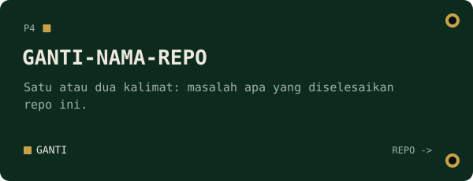</a>

 

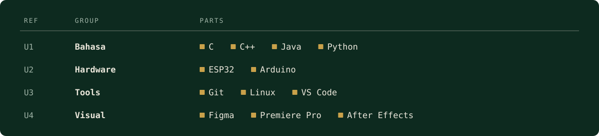

 

  
  

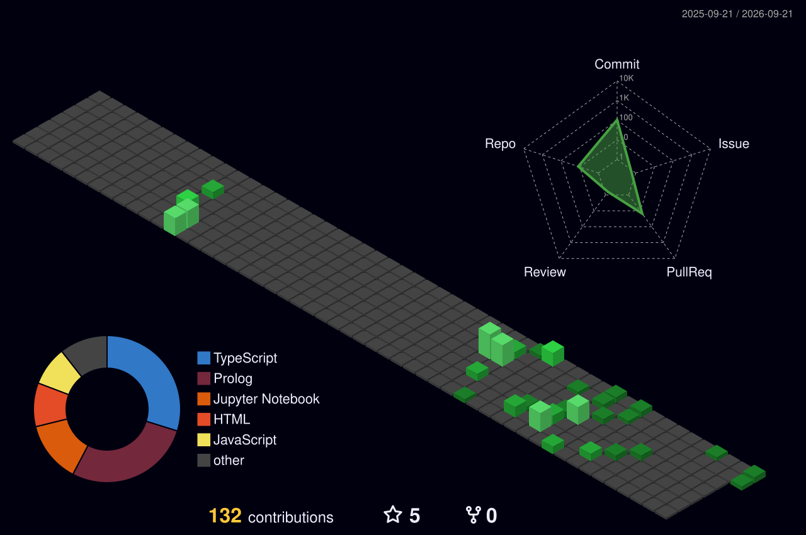

 

  <a href="https://levvtzy.xyz">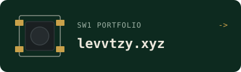</a>
  <a href="https://www.linkedin.com/in/jonathanlewie">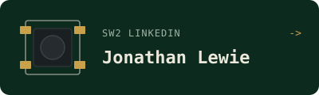</a>
  <a href="mailto:levvrae@gmail.com">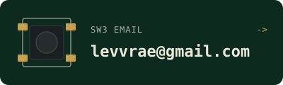</a>

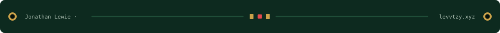
