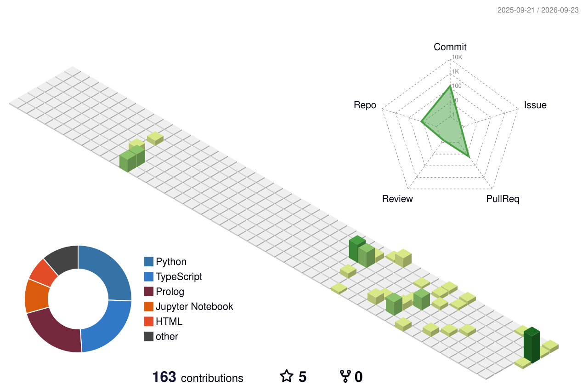

<!-- ============ HEADER ============ -->

  

  
  
  

---

<!-- ============ ABOUT ============ -->

 

<!-- ============ PROJECTS ============ -->

<!-- ============ TOOLS ============ -->
### Tools

  

<!-- ============ ACTIVITY ============ -->
### Aktivitas

  
  

  <picture>
    <source media="(prefers-color-scheme: dark)" srcset="./profile-3d-contrib/profile-night-view.svg" />
    <source media="(prefers-color-scheme: light)" srcset="./profile-3d-contrib/profile-green-animate.svg" />
    
  </picture>

  <picture>
    <source media="(prefers-color-scheme: dark)" srcset="./profile/snake-dark.svg" />
    <source media="(prefers-color-scheme: light)" srcset="./profile/snake.svg" />
    
  </picture>

<!-- ============ FOOTER ============ -->
 

  

